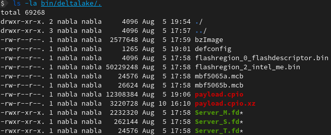

# Facebook Deltalake

This build script generates an image for Facebook's OCP Deltalake. The user has
to provide the following files, as they are not redistributable or under NDA, or
both.

All files need to be placed in the `bin/deltalake` folder.

* flashregion_0_flashdescriptor.bin - The Intel Firmware Descriptor binary file
* flashregion_2_intel_me.bin - The Intel Management Engine binary file
* mbf5065X.mcb - Microcode updates for the CPUs your system uses
* Server_M/S/T.fd - The FSP-M/S/T .fd files

It should look like this:

Once the files have been placed in the binary folder, the build can be started
with executing `make`. `make clean` cleans up all artifacts. The generated
firmware image can be found under `src/coreboot/build/coreboot.rom`.